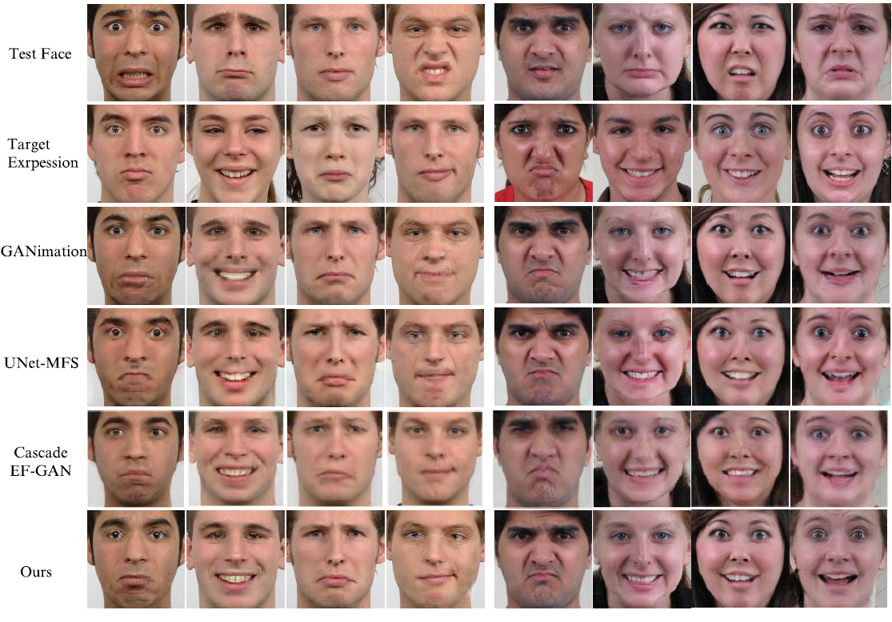
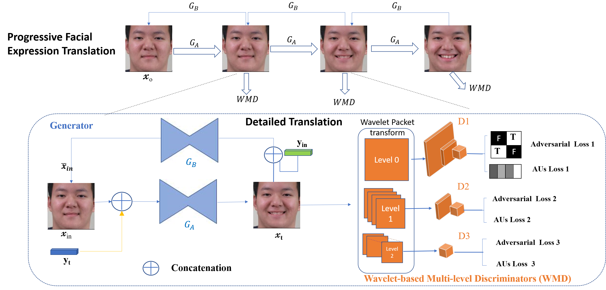
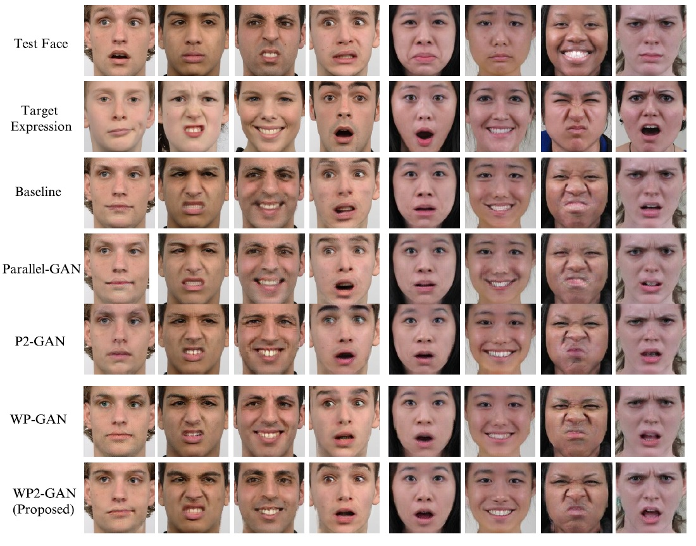

# WP2-GAN: Wavelet-based Multi-level GAN for Progressive Facial Expression Translation with Parallel Generators



[**Paper**](https://papertalk.org/papertalks/34297) | 


This repository contains official inference code for WP2-GAN.

WP2-GAN can perform continuous facial expression translation by taking a source face image and a target AUs code as input.


### Important disclaimer

In our experiments, all images are aligned, cropped and resized to the size of 128128 by [Openface](https://github.com/TadasBaltrusaitis/OpenFace).




##  Getting started

Download expression datasets [RafD](https://www.tandfonline.com/doi/abs/10.1080/02699930903485076) and [CFEED] (https://www.pnas.org/doi/10.1073/pnas.1322355111)

Images cropping and extract AUs code using [Openface](https://github.com/TadasBaltrusaitis/OpenFace).

Prepare meta attributes of input images by "prepare_au_annotations.py" in ```data``` folder.

Prepare the classifier by "exp_classify.py".

Train WP2-GAN model: 

```python
python3 main.py
```
Test model:

```python
python3 inference.py
```

Calculate Expression Translation Accuracy：
```python
python3 exp_classify.py
```

Calculate SIIM：
```python
python3 SIIM.py
```

USing [FID](https://github.com/mseitzer/pytorch-fid) for FID score.





### License

This code and model are available for scientific research purposes as defined in the LICENSE file. 
By downloading and using the project you agree to the terms in the LICENSE.
Please note that the restriction on distributing this code for non-scientific purposes is limited.

## Links
We acknowledge the following projects that were essential and speed up the developement.  
- [Openface] (https://github.com/TadasBaltrusaitis/OpenFace) for image cropping.
- [Resnet-18](https://pytorch.org/vision/main/models/generated/torchvision.models.resnet18.html) for expression classification.
- [WPT](https://github.com/fbcotter/pytorch_wavelets) for Wavelet Packet Transform based on Pytorch.
- [FID](https://github.com/mseitzer/pytorch-fid) and [SSIM](https://pytorch.org/ignite/_modules/ignite/metrics/ssim.html#SSIM) for image quality.

## Citation
If you found this code helpful, please consider citing: 

```
@inproceedings{shao2021wp2,
  title={WP2-GAN: Wavelet-based Multi-level GAN for Progressive Facial Expression Translation with Parallel Generators},
  author={Shao, Jun and Bui, T},
  booktitle={Proc. British Mach. Vis. Conf.. pp},
  pages={1388--1},
  year={2021}
}
```
